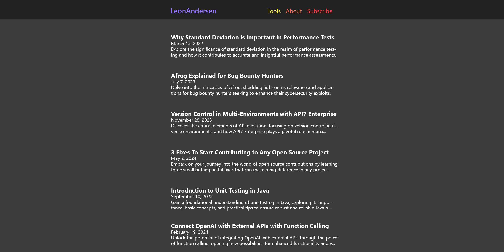

import Collapsible from '../../components/collapsible';
import MdxLayout from "../../components/mdx-layout";
import Head from 'next/head'
import Image from 'next/image'
import homepagedraft from '../../../public/homepagedraft.png'

export default function MDXPage({ children }) {
  const headtitle= "2024 Blog Code Guide"
  return (<>
    <MdxLayout>
        <Head><title>{headtitle}</title></Head>
    <div className="text-justify">
      {children}
    </div> 
    </MdxLayout>
    </>
  );
}


## How to Code a Blog in 2024 <br/>(with MDX and Next14 Pages-Routing)

<div className="text-neutral-400 text-sm">
January 2, 2024 - 21min - #tutorial #blog #webdevelopment #docs
</div>

Welcome to the step-by-step guide of how you can build a blog-website just
like this - using ReactJS, Tailwind, NextJS, MDX and MailChimp.

**Why use pages routing in 2024/ Next14?** Eventhough NextJS is trying to
force everyone to use App-Routing, you will likely encounter older projects at
work, that still use pages routing. It's a valuable skill to know the legacy ways. 

**Why MDX with pages routing?** Besides the capability to use react components
to make your article more interactive: In pages routing you can route with your
blog-post-title.mdx files, and render them as pages directly without needing to
parse them through the usual [slug/id].js file. This way you also don't need
getStaticRoutes.

To build this setup, I had to pick pieces from many different tutorials. 
In this guide I bring it all together.

<a id="toc"></a>
### Table of Contents

0. [Prerequisites](#prerequisites) 
1. [Process Overview](#process-overview)
2. [Detailed Steps](#detailed-steps)
3. [Insights](#insights)

_Disclaimer: The instructions of this guide are just my personal recommendations. Feel free to customize to your own taste._
<div className="text-neutral-300">

<a id="prerequisites"></a>
### [Prerequisites](#toc)

If you are a complete beginner at coding, first work through something like the Webdeveloper Bootcamp by Colt Steele. That's what gave me the foundations for this blog project.

For learning **Tailwind**, scan through [this](https://www.youtube.com) short tutorial on 1.5-2x speed. 
Then learn to actually use it by building your own blog with it. 
With Tailwind-Docs-Search and ChatGPT, this is fun and easy. 
Except for some basic CSS overview, I had almost zero experience with it before this blog.
For the harder part of styling - positioning and responsive design - I also wrote intructions in this article.

If you are new to to Github/ version control: Work through [this]() Git Crash Course. And read through [conventional commits]().

IMPORTANT: Before starting your blog project, finish reading this article, bookmark it and then watch [this]() little NextJS course on 1.5-2x speed. 
This will give you a workable overview of how pages routing and the NextJS basics work.

</div>
## <a id="process-overview" href="#toc">PROCESS OVERVIEW</a>

Working along this structure made the process smooth and straight-forward:

- [vision/ scope](#vision-scope)
  - [modeling](#modeling) (reference ui/ux)
  - [drafting](#drafting) (visual and written)
- [setup](#setup)
  - [mockup content](#mockup-content)
  - [component plan](#component-plan)
  - [basic structure & routing](#basic-structure-and-routing)
- [main building](#main-building)
  - [logic](#main-building)
  - [styling](#main-building)

## <a id="vision-scope" href="#process-overview"> Vision/ Scope </a>

### <a id="modeling" href="#process-overview">Modeling</a>
If you want to build websites as cool as your idols - steal from them. 
Seriously, everything is a remix. Pick whatever sparks your fire, even outside the box of websites.

I stole from:

- bettermotherfuckingwebsite.com (main content width and breath)
  - img](https://youtube.com)](https://youtube.com)
- nav.al (subscribeform in navbar)
  - img
- overreacted.io (navbar content centered and colorfulness)
  - img
- AbletonLive Music Production Suite (tag colors I used in my producer days)
  - img

### <a id="drafting" href="#process-overview">Drafting</a>
#### Visual
Draft out the design first. At least roughly. Positioning, proportions,
colortheme, font vibe, most important elements and pages. I used Photoshop, but Gimp or
even pen and paper could do. IMPORTANT: Also draft out how it should look on mobile aswell!

Knowing precisely what I wanted to build, and seeing it almost alive from the start, felt really helpful to me.
This kept me motivated and always clear about the next steps.

It is also a good measurement of how closely you can create what you (or your designers) have planned.
Of course you can keep happy accidents, but don't take them as an excuse to not create and learn what you wanted to in the first place.

I am pretty proud of how close I got:

	
{/*  */}
<Image src={homepagedraft}  alt="my draft for the homepage"/>


#### Written

Brainstorm notes of all the elements, features and effects you want as bulletpoints.

Include stuff that you are not sure about. Just tag that with question marks. 
Sort and trim later.

Use these notes and this article as the source for your to do lists.

## <a id="setup" href="#process-overview">Setup</a>

### <a id="mockup-content" href="#process-overview">Mock Up content</a>

Create placeholder articles and other page content using the LLM of your choice. 

It's easy and makes the building process more fun and realistic.

Here are the prompts I used:

- generate 5 interesting article titles for my dev blog
- format as previews, including a random date and a preview sentence
- write out the first one as a full article including code examples
- write me a short about page

### <a id="component-plan" href="#process-overview">Component Plan</a> 

Brainstorm a list of all the major (react-) components and pages you will likely need to build, like this:

- BlogFeedPage (index/ home) 
- Menu
- Navbar
- Footer
- Layout (main template)
- SubcribeForm (navbar, footer, menu, onpage)
- About
- Imprint
- 404


### <a id="basic-structure-and-routing" href="#process-overview">Basic Structure and Routing</a>

- Create all of the components, including their basic HTML elements (e.g. put links in a ul in the navbar). 
- Place them in their rough component structure (e.g. navbar and footer inside of the layout component).
- Insert the mockup content.

For all of this, use the file naming and folder structure of the NextJS pages
routing as explained in the [video](https://youtube.com) I mentioned in the
prerequisites. (no need for getStaticProps yet)

Here is my basic routing explained:

<div className="prose-pre:leading-4 prose-pre:bg-neutral-800">
```
src/
├── components
├── pages/
│   ├── api
│   ├── posts/ 
│   │   └── blog-titles.mdx   // auto-routed to .com/posts/filename (+ collected for postsData.js)
│   ├── _app.js
│   ├── _document.js
│   ├── 404.js                // auto-recognized by reserved filename and implemented as 404 
│   ├── about.js              // .js and .mdx get auto-routed to .com/filename
│   ├── imprint.mdx           
│   └── index.js              // auto-routed as leonandersen.com/ via reserved filename 
├── styles
├── utils/
│   ├── postsData.js          // (getStaticProps: fetches blogfeed preview data from ./pages/posts to index.js)
│   └── ...
└── ...
```
</div>

#### Bonus: Structuring HTML

One of the bigger learnings for me, was how to properly structure the HTML Tags in a real project. 
To many this might be obvious, but the bootcamp I worked through, did not point out HTML Tag Structure explicitly enough.
So here is my recap, sorted by functionality:

1. Accessibility
- navbar h1 ul li a li a li a

2. CSS
- for css to work properly(grouping, relatives, general order for positioning) the nesting must be purposeful and clear 
body
main main
divs

3. Next.JS/ React Functionality
- layout, dom access

Note: This whole step of the basic structure (incl. html) just needs to be a starting point.
You will likely adjust it a lot in the rest of the process.

## <a id="main-building" href="#process-overview"> Main Building</a>

Now that you have the most important building blocks, you are ready for the main work: styling and logic.

I tried to separate styling-commits from logic-commits, but that is not always possible.
I would say the most natural way is a constant cycling between them. (img: unrealistic vs realistic)

## <a id="detailed-steps" href="#toc"> Detailed Steps</a>

In this section I explain most of the smaller steps.

To keep it organized, I wrote the bigger challenges into seperate, detailed articles.
You can find them here:
- <a href="some.link" className="underline text-violet-500"> MDX in Next 14 pages routing (incl. Syntax Highlighting)</a>
- <a href="some.link" className="underline text-orange-400"> Mailchimp in NextJS | Understand API / Server</a>
- <a href="some.link" className="underline text-red-500"> Blogpage Building Struggles: CSS height is cursed... until now!</a>

BlogFeedPage logic
Just like in [the NextJS original tutorial], you need the index page to act as a feed with previews of your posts. For this you need a blogfeed component and a metadata utility component in a separate file:

'''code with detailed comments'''


In Tailwind the Breaking Points are css mediaqueries pointing in one direction: from smaller to bigger screen sizes. 
Because of this, it makes sense to start the positioning part of the styling from the smallest screens (via chrome devtools f12) and work your way upwards from there.
I made the mistake to just draft the desktop screen design beforehand, so I also started with desktop styling. After I was done with that, I realized I had to redo much of the work and start over from mobile screen size. So you better draft out the mobile design beforehand aswell, so you can start from there. 

Tipp: Check how the websites you chose to model behave in mobile screens, to get a feel for the styling. 

Wax on Wax off: Each time you make styling changes, check for any wierd misalignments in all of the dev tools screen sizes over and over again.
I often stumbled upon meaningful styling problems, by testing the edgecases this way. The sooner you find them the better. 

Positioning is one of the major parts of responsive design, so if you are having problems with that, also make sure to check out my article on positioning in general.

Custom Breaking Points: Don't be afraid to create custom breaking points in Tailwind. At first I tried to force myself to only use the default breaking points, but sometimes there are misalignments, that can only be fixed this way. Make use of the tools at your fingertips. (How to customize breaking points in Tailwind: )
 
 


-- Menu Component 
Instead of using a premade menu component from a library like shadzcn, I built my own custom menu component.
'''code with detailed comments'''
You can get creative with what kind of icon you use for the opening the burger menu. For custom icons, you should use svg format as it scales with size. Svg gets inserted into your component as a long random string (similar to opening an mp3 file in the text editor), wrapped inside an html tag. Make sure to include "blablabla" in the html tag, to signal to screen readers, that they dont have to read out the random string of the svg.
Luckily I could skip that part and use divs with radius as my circles, because my icon was so simple I could directly create it in CSS.

-- menu close timing and logic
At this point I could open the menu and request pages, but the menu stayed open, so I added this logic:

The menu also needed to be closeable by clicking the menu icon again. For this, I had to implement a both way toggle closing logic:

I encountered the problem, that the menu closed faster, than the newly requested page loaded. This way, for a few milliseconds you always saw the page you were on before opening the menu. Eventhough requested pages load way faster in build mode, it still looked a bit glitchy. To counter that, I just added a timeout of 21 milliseconds on the eventlistener. Now the menu closes a bit slower and you land directly on the new page.

-- Scrollbar Menu
The last issue left with the menu, was that when open, the scrollbar of the underlying page was still showing. (which just takes up space and confuses, because the menu itself is not scrollable) Here is how I fixed that, using access to the dom, which I haven't done sinde the beginning of my bootcamp:


-- Subscribe Components logic and Styling
Growing an email list is one of the main objectives of a blog. So I found an everpresent subscribe form in the fixed navbar to be a cool idea. 
To keep it a bit less in your face I only want it to be fully expanded, once clicked. Here is the logic for that:

As mentioned above, [here] you can find my guide how I set up the NextJS API to connected to MailChimp (a Newsletter Management Service).

-- 404 styling
To mix in some fun, I designed a fancy [404 page]. I've always wanted to use ASCII art and go ham with synth wave colors and gradients. This could be your chance for experiments too! 
The ASCII art needed some extra formatting to get rendered properly:
- disable prettier
- linebreaks after each line
- a character at the start of each line (to keep the whitespaces before the first ascii characters)
-- To make it look good with these extra charachters, I added characters all around the ascii content, which now serves as a border/ frame.
Tipp: Check out the 404 pages of your reference websites, to get a feel for a good 404.

-- font, textwrap and color etc. finetuning
Setting the font, sizes, textwrap and colors properly can take some time.

I had struggles with the font, because the current NextJS Font setup (font@next???) for some reason displays a different font than the actual OpenSans.
I would not recommend this for websites with vulnerable data, but: For now I left it in the deprecated legacy setup (legacy font setup), because differences in font completely changed the vibe, and also destroyed some alignments. For example the *expanded* subscribe form needs pixelperfect positioning to stay aligned with the *closed* "Subscribe" button.

If you read this on desktop, you can test right now, how well the "subscribe" text is staying in place, both in open and closed state. If it is well aligned, you've got another reason to type in your best email and subscribe.

Size matters! For most of the process, I had all text one or two (Tailwind-) sizes bigger. After a while I noticed a feeling as if I was working on a device for elders or toddlers. You know these phones with giant buttons? I compared fontsizes with my reference websites, and I realized, that I had taken readability one step too far. So I sized down. It made a GIANT difference: Finally, I feel sleek as Apple. 

All of the page content lives in the middle 1/3 within a frame that is set by the elements in the header and footer. The clearer the page content fills up to this frame, the cleaner the overall vibe. (img vs fuzzy line endings: imprint vs feed vs post)
I tried different ways to do that and learned the following:

- bindestrich can come too many lines and is too hard to read, so i cannot take that for post content, nor even for the article previews on the feed page. I would not know where to actually use that.
- text balance creates way too much random space in between, unfortunately it cannot be finetuned so it looked wierd even on bigger text chunks
it only really works with walls of text that are not as important, just as the imprint page (sorry lawyers)
-- i also took it for the feed page, because here the line endings are especially fuzzy, because there is not that much text
- medium and substack have none of these wraps for their articles so I figured it is fine to keep the posts all natural

I had the main colors set from the beginning. I use a mix of Tailwinds amazing default classes, but also created a few custom colors.
For details like the Subscribe form below or my 404 page, I experimented alot with different color variations until I was happy. The main lesson for me is to not use too many different colors at once. I would say the only reason I can have 3!!! different main brand colors plus 2 more for details, is because everything else is gray.

-- headtitles staticpages 
Head titles become the title shown in the browser tab. You could keep it minimalistic and only show "Your Website Name" at each different subpage. But it is way more professional and a better user experience, to render the individual title of each subpage that you are on ("Blog Post About Special Topic", "About", "Contact" etc.) You can just write them into the head tags of your mdx pages like this:

I have not found a way to automate putting the title into the headtag yet. But it might not even make sense anyways, because the title is often too long, in which case you need an even shorter version of it.

-- favicon
A small but important detail is to set your favicon -- the icon of your blog that gets shown in the browser tab and in searchengine results. If you don't set it, you let the browser show a default icon. This looks like your website is broken, offline, or out of date. You don't need much to look professional. INSERT FAVICON EASY PROCESS  

BONUS:
What I left out
--- ID page
I started learning NextJS by following [this] and [this] tutorial. They don't use mdx as pages, so I first also built an ID page. It acts as a template that fetches all your blog posts as different pages and sets their slug as their path (slug = id = blog-post-title-dashed). For this we use NextJS's GetStaticPaths feature. I can recommend to check out how it roughly works, but it is easier to leave it out to properly render your custom MDX formatting.

--- colortheme
---- I built a beautiful colortheme matching the blog-colors myself using THIS tool. But unfortunately after tons of hours spent and an annoying Microsoft Azure publishing process, it was not compatible with the current version of VS Codium. So I left my baby behind to keep moving with the stuff that matters.

--- re-Setup nextjs linux vs macbook m1 incl. git sorting
Sidestory about workload management and Linux:
At some point I lost track of my different git branches and trimmed everything away except for my main branch with the latest merges. I then swiped my local repository, so I could download and re-install only my main branch. Unfortunately, NextJS did not properly run after that. I thought I'd had to manually copy file by file from github to find where I messed up. So I thought, in that case I could use that restart to setup linux and rebuild the project there. I definitely learned some things, but honestly it was a waste of 2-3 days. There were so many obstacles on the way to get it running, that I decided to postpone my linux journey to sometime else, once I can afford a personal Linux Mentor. 
Luckily one of my best friends offered to lend his M1 chipped MacBook to me. After setting up VS Codium and pulling my repository from github, it immediately worked. The reason for NextJS crashes can be old hardware.
However, the bigger moral of this: Don't learn coding + typing + vim + linux(lol) at the same time.

--- 404 redirect
In the Webninjas NextJS tutorial, they build an automatic redirect from the 404 back to home. I tried that aswell, but it comes with problems: 1. If you click towards another page in the meantime, you will get redirected to home shortly afterwards. 2. You might confuse the user, about what happened, if he did not notice the 404 sign in between the redirect. 3. The user will not have the chance to sufficiently marvel at your beautiful 404 page.
Just do it like google: Present a link that the user can manually click for redirection. Done.

--- scrollbar dark, header/footer-passend
I love the brave browser, but on windows it has a bright scrollbar even in darkmode. Let's say it politely: It interferes with the design. I tried a few different ways to make it dark, but nothing looked that great. I might catch up on that later, but for now there are more important things. At least the mac scrollbar looks great with the blog.

--- some styling details (variations, gradients, multifont, too many colors, too many hover and change effects)
I tried some crazy hover effects and multifont, but that was just too much, let's keep it minimalistic.

From here on most is just documentation/ journaling insight for myself. I want to share these notes here though to keep everything at one place, and maybe you get some things out of this aswell.

## <a id="insights" href="#toc"> Learning Process Insights</a>
-- not all tuts are perfect
Not all tutorials are perfect. I had a few times, where I was super confused because the tutorial said something that was contrary to what I already know. For some moments I doubted myself, but luckily I found some ways to test and verify that actually I was right. Not always of course. Be aware, be relaxed. 

-- balance of reading details and filtering fast
One challenge I had was to balance filtering fast through tons of content, with also not missing important details. Once you found some resources with seeming high quality, take your time to understand the details. I had to learn NextJS twice, because I skipped all details the first round. However, sometimes this can be the right approach aswell.

-- having a mentor helps a lot
I am just incredibly grateful for my mentor Alyph Nill from ten-x-dev. Having personal support for complicated questions helped me so much. I don't know where I would be with out him. And yes, there were a lot of moments where ChatGPT was not enough or even misleading.

-- scoping drafting helped a lot
At first I was insecure, if I might be wasting time with all the scoping and drafting, but I will do that 100% again for the next project. I am pretty sure I would have wasted way more time fooling around with CSS than with an easy tool such as Photoshop first.

-- time with design pros and cons
I was also insecure about maybe wasting time with design experiments that went beyond my initial draft.
However, there were a few things that I just wasn't able to predict from the drafting stage. I am happy I took my time with them. Except for a little fun with the 404 page, everything was in an appropriate range.

-- chat gpt is better AND worse than google
-- learning vim and git and typing and nextjs and css and linux etc. at once can make you slower than you wish
-- installing vs programming
One thing that annoyed me was how much time I had to spent just with the basic setup of elements such as mdx and syntax highlighting. I definitely prefer the part of actually coding as opposed to installing. However I might not get around installing any time soon, so I set the intention of enjoying those processes and maybe even finding ways to make them faster. We will see.

-- QuestionStorming technique for some challenges, not for others(?)
For challenges like finding a way to use mdx in a different way than described on the NextJS docs, I used a written rubberducking method I usually use for personal decisions. I was excited that it works with coding too, so I will probably write an article about that method in the future.
-- cycling between style and logic
-- make it work. make it clean. make it fast.
-- technical insights from main challenges
-- days of stuckness are preparation for wins
-- JS insecurity, random abstract learning, ok if yt blocker

- Future Features
--\ speedreader
-- new sub page "tools" with projects i built incl. wordmaster?
-- filter by tags
- Future Patches
-- scrollbar => progressbar
-- reading time
-- headtitle autoparsing
-- color theme
-- curious but unneccessary = solution for 404 ascii font size rigidity
-- syntax copy button
-- vim scrolling 
-- font fix maybe one day?


